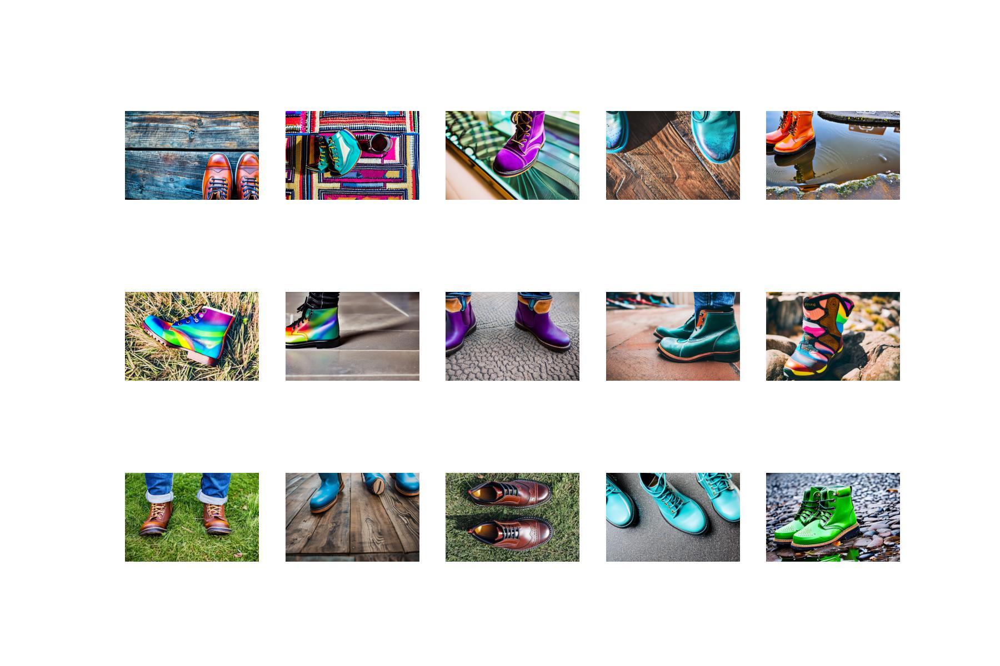

# Products images generation

This notebook is generating artificial products images using some prompts.
Easy to generate artificial images of products for example with a list of multiple prompts (camera angle, products, products color, scenes...).

## Some boots examples

## Some high heels shoes examples

## Some loafers shoes examples

## Some sneakers examples

08-Jun-2022 Serge Retkowsky | serge.retkowsky@microsoft.com | https://www.linkedin.com/in/serger/
